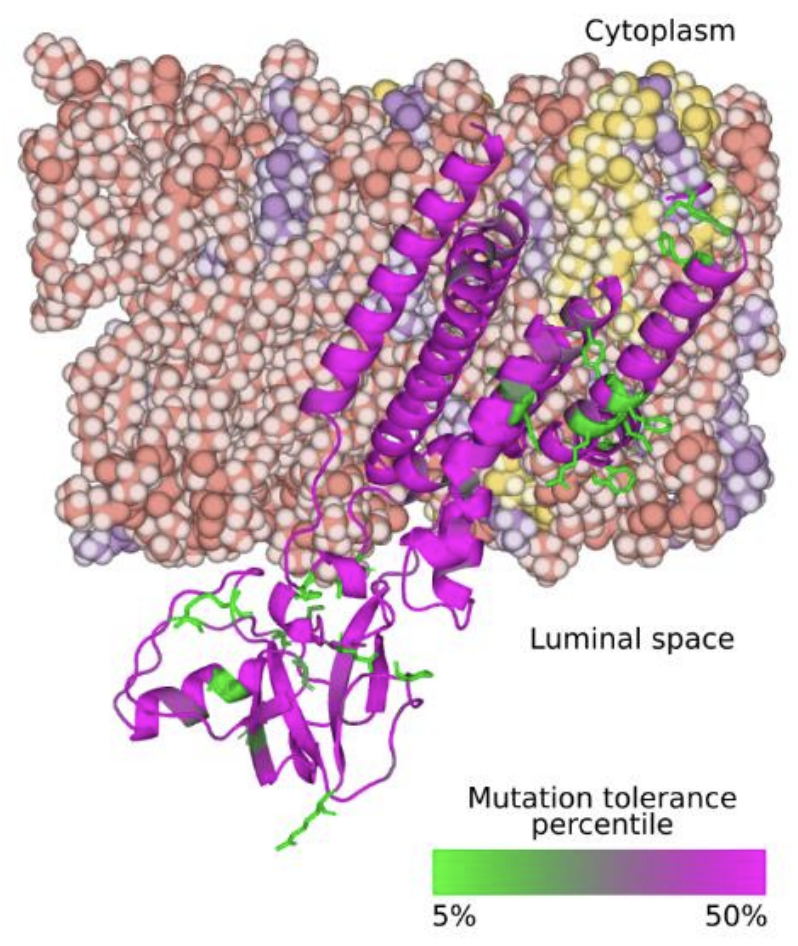
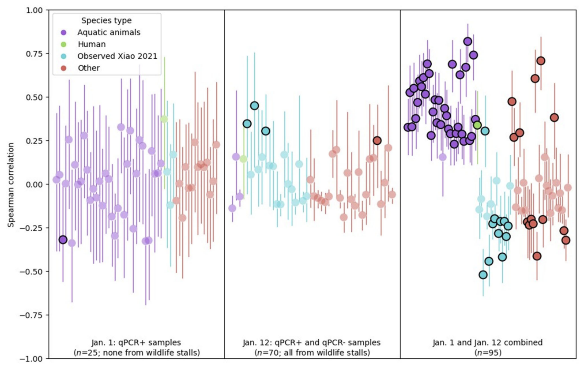
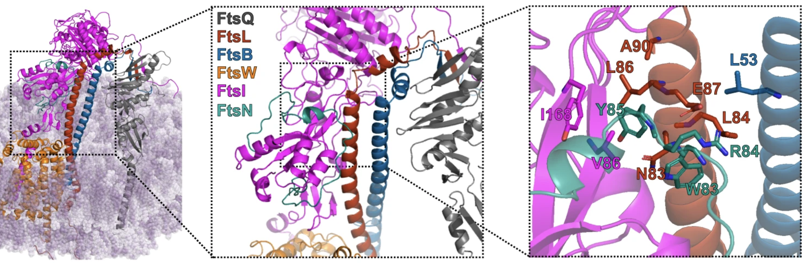
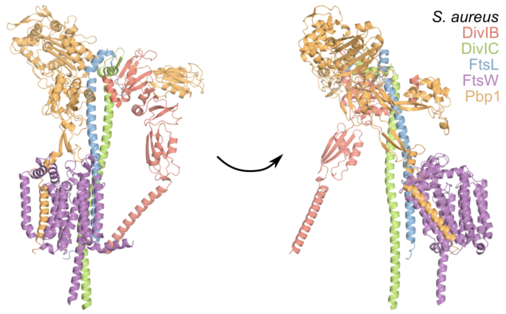
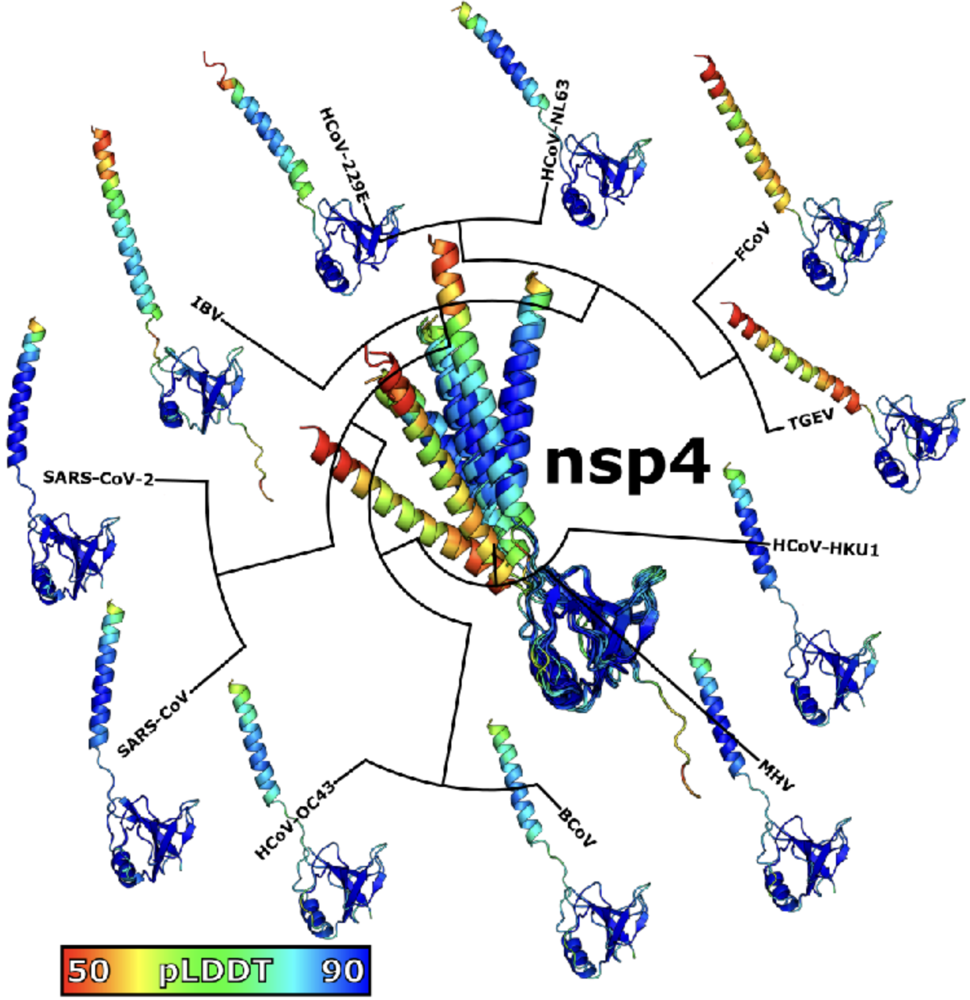

## Our research

We focus on single-molecule experiments in living cells using fluorescent proteins and other fluorescent molecules.

We also work on improved methods for recombinant gene expression and have distributed some plasmids that are very useful for low-noise gene expression that can be found at [AddGene](https://www.addgene.org/Zach_Hensel/).

## Publications from lab members

[Google Scholar](https://scholar.google.com/citations?user=QwsENLQAAAAJ&hl=en) - [ORCID](https://orcid.org/0000-0002-4348-6229): 0000-0002-4348-6229

Lab members in **bold**\
† Equal contribution\
\# Preprint not published elsewhere\
\* Corresponding author\

### Research manuscripts (including preprints not published elsewhere)

Click titles to **expand abstracts** and see data/analysis from our lab!

<ul markdown="1">
<li markdown="1">

# <b>Z Hensel</b>*. Secondary structure of the SARS-CoV-2 genome is predictive of nucleotide substitution frequency. bioRxiv 581995, 2024. <a href="https://doi.org/10.1101/PENDING">https://doi.org/10.1101/PENDING</a>

**Abstract**: Accurate estimation of the effects of mutations on SARS-CoV-2 viral fitness can inform public-health responses such as vaccine development and predicting the impact of a new variant; it can also illuminate biological mechanisms including those underlying the emergence of variants of concern. Recently, Lan et al reported a high-quality model of SARS-CoV-2 secondary structure and its underlying dimethyl sulfate (DMS) reactivity data. I investigated whether secondary structure can explain some variability in the frequency of observing different nucleotide substitutions across millions of patient sequences in the SARS-CoV-2 phylogenetic tree. Nucleotide basepairing was compared to the estimated “mutational fitness” of substitutions, a measurement of the difference between a substitution’s observed and expected frequency that is correlated with other estimates of viral fitness. This comparison revealed that secondary structure is often predictive of substitution frequency, with significant decreases in substitution frequencies at basepaired positions. Focusing on the mutational fitness of C→T, the most common type of substitution, I describe C→T substitutions at basepaired positions that characterize major SARS-CoV-2 variants; such mutations may have a greater impact on fitness than appreciated when considering substitution frequency alone.

</li> 

<li markdown="1">

# F Débarre*, <b>Z Hensel</b>. A critical reexamination of recovered SARS-CoV-2 sequencing data. bioRxiv 580500, 2024. DOI: <a href="https://doi.org/10.1101/2024.02.15.580500">https://doi.org/10.1101/2024.02.15.580500</a>

**Abstract**: SARS-CoV-2 genomes collected at the onset of the Covid-19 pandemic are valuable because they could help understand how the virus entered the human population. In 2021, Jesse Bloom reported on the recovery of a dataset of raw sequencing reads that had been removed from the NCBI SRA database at the request of the data generators, a scientific team at Wuhan University (Wang et al., 2020b). Bloom suggested that the data may have been removed in order to obfuscate the origin of SARS-CoV-2, and he questioned the generating authors' statements that the samples had been collected on and after January 30, 2020. Here, we show that sample collection dates were published in 2020 by Wang et al. together with the sequencing reads, and match the dates given by the authors in 2021. We examine mutations in these sequences and confirm that they are entirely consistent with the previously known genetic diversity of SARS-CoV-2 of late January 2020. Finally, we explain how an apparent phylogenetic rooting paradox described by Bloom was resolved by subsequent analysis. Our reanalysis demonstrates that allegations of cover-up or of metadata manipulation were unwarranted.

</li> 

<li markdown="1">

L Zimmermann, X Zhao, J Makroczyova, M Wachsmuth-Melm, V Prasad, <b>Z Hensel</b>,  R Bartenschlager, P Chlanda*. SARS-CoV-2 nsp3 and nsp4 are minimal constituents of a pore spanning replication organelle. Nature Communications 14, 2023. <a href="https://doi.org/10.1038/s41467-023-43666-5">https://doi.org/10.1038/s41467-023-43666-5</a>

**Abstract**: Coronavirus replication is associated with the remodeling of cellular membranes, resulting in the formation of double-membrane vesicles (DMVs). A DMV-spanning pore was identified as a putative portal for viral RNA. However, the exact components and the structure of the SARS-CoV-2 DMV pore remain to be determined. Here, we investigate the structure of the DMV pore by in situ cryo-electron tomography combined with subtomogram averaging. We identify non-structural protein (nsp) 3 and 4 as minimal components required for the formation of a DMV-spanning pore, which is dependent on nsp3-4 proteolytic cleavage. In addition, we show that Mac2-Mac3-DPUP-Ubl2 domains are critical for nsp3 oligomerization and crown integrity which influences membrane curvature required for biogenesis of DMVs. Altogether, SARS-CoV-2 nsp3-4 have a dual role by driving the biogenesis of replication organelles and assembly of DMV-spanning pores which we propose here to term replicopores.

</li> 

<li markdown="1">

# A Crits-Christoph, JI Levy, JE Pekar, SA Goldstein, R Singh, <b>Z Hensel</b>, K Gangavarapu, MB Rogers, N Moshiri, RF Garry, EC Holmes, MPG Koopmans, P Lemey, S Popescu, A Rambaut, DL Robertson, MA Suchard, JO Wertheim, AL Rasmussen, KG Andersen*, M Worobey*, F Débarre*. Genetic tracing of market wildlife and viruses at the epicenter of the COVID-19 pandemic. bioRxiv 557637, 2023. <a href="https://doi.org/10.1101/2023.09.13.557637">https://doi.org/10.1101/2023.09.13.557637</a>

**Abstract**: Zoonotic spillovers of viruses have occurred through the animal trade worldwide. The start of the COVID-19 pandemic was traced epidemiologically to the Huanan Wholesale Seafood Market, the site with the most reported wildlife vendors in the city of Wuhan, China. Here, we analyze publicly available qPCR and sequencing data from environmental samples collected in the Huanan market in early 2020. We demonstrate that the SARS-CoV-2 genetic diversity linked to this market is consistent with market emergence, and find increased SARS-CoV-2 positivity near and within a particular wildlife stall. We identify wildlife DNA in all SARS-CoV-2 positive samples from this stall. This includes species such as civets, bamboo rats, porcupines, hedgehogs, and one species, raccoon dogs, known to be capable of SARS-CoV-2 transmission. We also detect other animal viruses that infect raccoon dogs, civets, and bamboo rats. Combining metagenomic and phylogenetic approaches, we recover genotypes of market animals and compare them to those from other markets. This analysis provides the genetic basis for a short list of potential intermediate hosts of SARS-CoV-2 to prioritize for retrospective serological testing and viral sampling.

</li> 

<li markdown="1">

†BM Britton, †RA Yovanno, <b>SF Costa</b>,  J McCausland,  AY Lau,  J Xiao*, <b>Z Hensel</b>*. Conformational changes in the essential <i>E. coli</i> septal cell wall synthesis complex suggest an activation mechanism. Nature Communications 14, 2023. <a href="https://doi.org/10.1038/s41467-023-39921-4">https://doi.org/10.1038/s41467-023-39921-4</a>

**Abstract**: The bacterial divisome is a macromolecular machine composed of more than 30 proteins that controls cell wall constriction during division. Here, we present a model of the structure and dynamics of the core complex of the *E. coli* divisome, supported by a combination of structure prediction, molecular dynamics simulation, single-molecule imaging, and mutagenesis. We focus on the septal cell wall synthase complex formed by FtsW and FtsI, and its regulators FtsQ, FtsL, FtsB, and FtsN. The results indicate extensive interactions in four regions in the periplasmic domains of the complex. FtsQ, FtsL, and FtsB support FtsI in an extended conformation, with the FtsI transpeptidase domain lifted away from the membrane through interactions among the C-terminal domains. FtsN binds between FtsI and FtsL in a region rich in residues with superfission (activating) and dominant negative (inhibitory) mutations. Mutagenesis experiments and simulations suggest that the essential domain of FtsN links FtsI and FtsL together, potentially modulating interactions between the anchor-loop of FtsI and the putative catalytic cavity of FtsW, thus suggesting a mechanism of how FtsN activates the cell wall synthesis activities of FtsW and FtsI.

</li> 

<li markdown="1">

# S Schäper, AD Brito, BM Saraiva, GR Squyres, MJ Holmes, EC Garner, <b>Z Hensel</b>, R Henriques, *MG Pinho. Processive movement of <i>Staphylococcus aureus</i> essential septal peptidoglycan synthases is independent of FtsZ treadmilling and drives cell constriction. bioRxiv 547026, 2023. <a href="https://doi.org/10.1101/2023.06.29.547026">https://doi.org/10.1101/2023.06.29.547026</a>

**Abstract**: Bacterial cell division is mediated by the tubulin-homolog FtsZ, which recruits peptidoglycan (PG) synthesis enzymes to the division site. Septal PG synthases promote inward growth of the division septum, but the mechanisms governing the spatiotemporal regulation of these enzymes are poorly understood. Recent studies on various organisms have proposed different models for the relationship between the movement and activity of septum-specific PG synthases and FtsZ treadmilling. Here, we studied the movement dynamics of conserved cell division proteins relative to the rates of septum constriction and FtsZ treadmilling in the Gram-positive pathogen *Staphylococcus aureus*. The septal PG synthesis enzyme complex FtsW/PBP1 and its putative activator protein, DivIB, moved processively, around the division site, with the same velocity. Impairing FtsZ treadmilling did not affect FtsW and DivIB velocities or septum constriction rates. Contrarily, inhibition of PG synthesis slowed down or completely stopped both septum constriction and the directional movement of FtsW/PBP1 and DivIB. Our findings support a model for *S. aureus* in which a single population of processively moving FtsW/PBP1 remains associated with DivIB to drive cell constriction independently of treadmilling FtsZ filaments.

</li> 

<li markdown="1">

# <b>Z Hensel</b>*. Predicted binding interface between coronavirus nsp3 and nsp4. bioRxiv 483145, 2022. <a href="https://doi.org/10.1101/2022.03.05.483145">https://doi.org/10.1101/2022.03.05.483145</a>

**Abstract**: Double membrane vesicles (DMVs) in coronavirus-infected cells feature pores that span both membranes. DMV pores were observed to have six-fold symmetry and include the nsp3 protein. Co-expression of SARS-CoV nsp3 and nsp4 induces DMV formation, and elements of nsp3 and nsp4 have been identified that are essential for membrane disruption. I describe a predicted luminal binding interface between nsp3 and nsp4 that is membrane-associated, conserved in SARS-CoV-2 during the COVID-19 pandemic and in diverse coronaviruses, and stable in molecular dynamics simulation. Combined with structure predictions for the full-length nsp4 monomer and cryo-EM data, this suggests a DMV pore model in which nsp4 spans both membranes with nsp3 and nsp4 inserted into the same bilayer. This approach may be able to identify additional protein-protein interactions between coronavirus proteins.

</li> 

<li markdown="1">
†R Letra-Vilela, †**R Quiteres**, F Murtinheira, A Crevenna, **Z Hensel**\*, F Herrera\*.
*New tools for the visualization of glial fibrillary acidic protein in living cells*.
Experimental Results 1, 2020.
[DOI: 10.1017/exp.2020.1](https://doi.org/10.1017/exp.2020.1).
</li>

<li markdown="1">
**JPN Silva**, **SV Lopes**,  **DJ Grilo**,  **Z Hensel**\*.
*Plasmids for independently tunable, low-noise expression of two genes*.
mSphere 4:e00340-19, 2019.
[DOI: 10.1128/mSphere.00340-19](https://doi.org/10.1128/mSphere.00340-19).
</li>

<li markdown="1">
X Fang, Q Liu, C Bohrer, **Z Hensel**, W Han, J Wang, J Xiao\*.
*New cell fate potentials and switching kinetics uncovered in a classic bistable genetic switch*.
Nature Communications 9, 2018.
[DOI: 10.1038/s41467-018-05071-1](https://doi.org/10.1038/s41467-018-05071-1).
</li>

<li markdown="1">
**Z Hensel**\*.
*A plasmid-based Escherichia coli gene expression system with cell-to-cell variation below the extrinsic noise limit*.
PLoS ONE 12, 2017.
[DOI: 10.1371/journal.pone.0187259](https://doi.org/10.1371/journal.pone.0187259).
</li>

<li markdown="1">
**Z Hensel**, TT Marquez-Lago.
*Cell-cycle-synchronized, oscillatory expression of a negatively autoregulated gene in E. coli*.
arXiv 1506.08596, 2015.
[Link](https://arxiv.org/abs/1506.08596).
</li>

<li markdown="1">
**Z Hensel**, X Weng, AC Lagda, J Xiao\*.
*Transcription-factor-mediated DNA looping probed by high-resolution, single-molecule imaging in live E. coli cells*.
PLOS Biology 11, 2013.
[DOI: 10.1371/journal.pbio.1001591](https://doi.org/10.1371/journal.pbio.1001591).
</li>

<li markdown="1">
†**Z Hensel**, †H Feng (equal contribution), B Han, C Hatem, J Wang, J Xiao\*.
*Stochastic expression dynamics of a transcription factor revealed by single-molecule noise analysis*.
Nature Structural and Molecular Biology 19, 2012.
[DOI: 10.1038/nsmb.2336](https://doi.org/10.1038/nsmb.2336).
</li>

<li markdown="1">
H Feng, **Z Hensel**, J Xiao, J Wang\*.
*Analytical calculation of protein production distributions in models of clustered protein expression*.
Physical Review E 85, 2012.
[DOI: 10.1103/PhysRevE.85.031904](https://doi.org/10.1103/PhysRevE.85.031904).
</li>

<li markdown="1">
G Fu, T Huang, J Buss, C Coltharp, **Z Hensel**, J Xiao\*.
*In vivo structure of the E. coli FtsZ-ring revealed by photoactivated localization microscopy (PALM)*.
PLoS ONE 5, 2010.
[DOI: 10.1371/journal.pone.0012680](https://doi.org/10.1371/journal.pone.0012680).
</li>

<li markdown="1">
E Barry, **Z Hensel**, Z Dogic, M Shribak, R Oldenbourg.
*Entropy-driven formation of a chiral liquid-crystalline phase of helical filaments*.
Physical Review Letters 96, 2006.
[DOI: 10.1103/PhysRevLett.96.018305](https://doi.org/10.1103/PhysRevLett.96.018305).
</li>
</ul>

### Reviews/Highlights

**Z Hensel**, J Xiao\*.
*Single-molecule methods for studying gene regulation in vivo*.
Pflügers Archiv-European Journal of Physiology 465, 2013.
[DOI: 10.1007/s00424-013-1243-y](https://doi.org/10.1007/s00424-013-1243-y).

**Z Hensel**, J Xiao\*.
*A mechanism for stochastic decision making by bacteria*.
ChemBioChem 10, 2009.
[DOI: 10.1002/cbic.200800824](https://doi.org/10.1002/cbic.200800824).

### Correspondence

S Sarabipour\*, HJ Debat, E Emmott, SJ Burgess, B Schwessinger, **Z Hensel**.
*On the value of preprints: an early career researcher perspective*.
PLoS Biology 17(2): e3000151, 2019.
[DOI: 10.1371/journal.pbio.3000151](https://doi.org/10.1371/journal.pbio.3000151).

S Sarabipour\*, EM Wissink, SJ Burgess, **Z Hensel**, HJ Debat, E Emmott, A Akay, KC Akdemir, B Schwessinger.
*Preprints are good for science and good for the public*.
Nature 560, 2018.
[DOI: 10.1038/d41586-018-06054-4](https://doi.org/10.1038/d41586-018-06054-4).

†S Sarabipour\*, †EM Wissink\*, †SJ Burgess\*, **Z Hensel**, H Debat, E Emmott, A Akay, KC Akdemir, B Schwessinger.
*Maintaining confidence in the reporting of scientific outputs*.
PeerJ Preprints 6, 2018.
[DOI: 10.7287/peerj.preprints.27098v1](https://doi.org/10.7287/peerj.preprints.27098v1).

### Patents/Methods

J Xiao, **Z Hensel**.
*Co-translational activation of a transcription factor by proteolytic cleavage and methods of use*.
US Patent 9,822,392 2017.
[Link](https://patents.google.com/patent/US9822392B2/en).

**Z Hensel**, X Fang, J Xiao.
*Single-molecule imaging of gene regulation in vivo using cotranslational activation by cleavage (CoTrAC)*.
Journal of Visualized Experiments, 2013.
[DOI: 10.3791/50042](https://doi.org/10.3791/50042).

### Published preprints

†BM Britton, †RA Yovanno, **SF Costa**,  J McCausland,  AY Lau,  J Xiao\*, **Z Hensel**\*.
*Conformational changes in the essential E. coli septal cell wall synthesis complex suggest an activation mechanism*.
bioRxiv 2022.11.27.518129v1, 2022
[DOI: 10.1101/2022.11.27.518129v1](https://doi.org/10.1101/2022.11.27.518129v1)

**JPN Silva**, **SV Lopes**,  **DJ Grilo**,  **Z Hensel**\*.
*Plasmids for independently tunable, low-noise expression of two genes*.
bioRxiv 515940, 2019.
[DOI: 10.1101/515940](https://doi.org/10.1101/515940).

S Sarabipour\*, HJ Debat, E Emmott, SJ Burgess, B Schwessinger, **Z Hensel**.
*On the value of preprints: an early career researcher perspective*.
PeerJ Preprints 6, 2018.
[DOI: 10.7287/peerj.preprints.27400v1](https://doi.org/10.7287/peerj.preprints.27400v1).

X Fang, Q Liu, C Bohrer, **Z Hensel**, W Han, J Wang, J Xiao\*.
*New cell fate potentials and switching kinetics uncovered in a classic bistable genetic switch*.
bioRxiv 215061, 2017.
[DOI: 10.1101/215061](https://doi.org/10.1101/215061).

**Z Hensel**\*.
*A plasmid-based Escherichia coli gene expression system with cell-to-cell variation below the extrinsic noise limit*.
bioRxiv 192963, 2017.
[DOI: 10.1101/192963](https://doi.org/10.1101/192963).

E Barry, **Z Hensel**, M Shribak, R Oldenbourg, Z Dogic.
*Entropy-driven formation of a chiral liquid-crystalline phase of helical filaments*.
arXiv cond-mat/0510708, 2005.
[Link](https://arxiv.org/abs/cond-mat/0510708).

