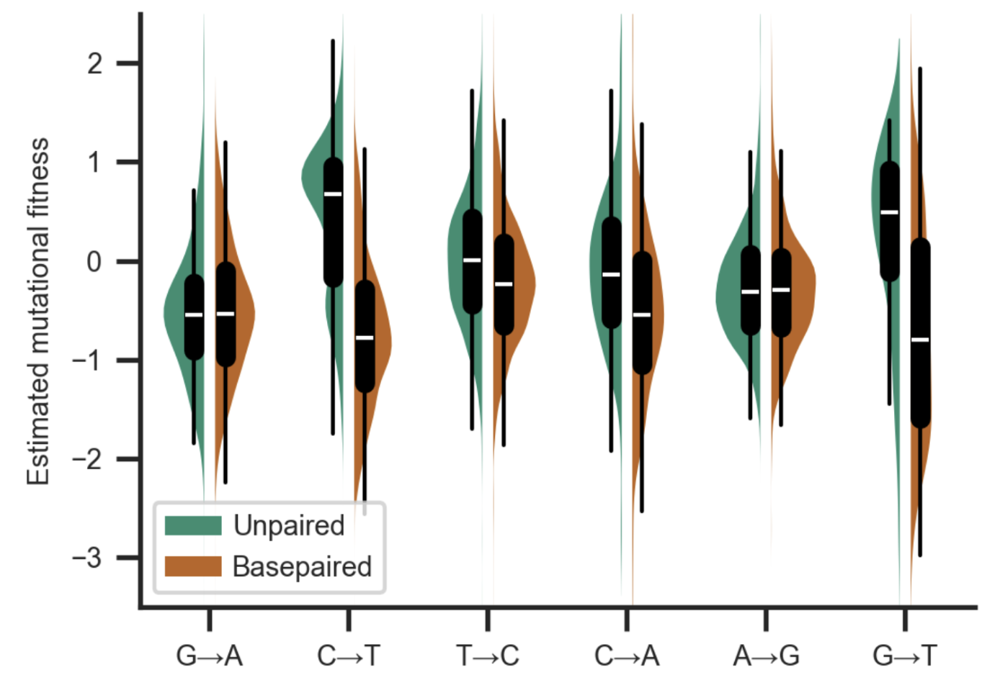
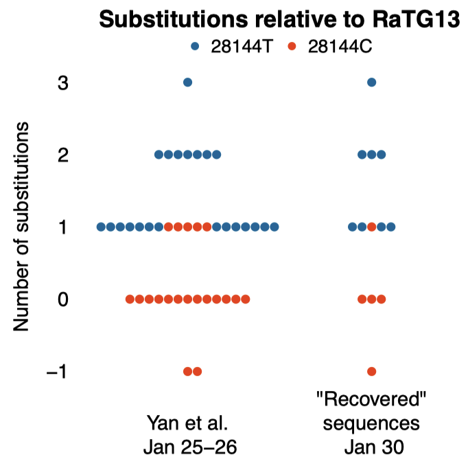

## Our research

We focus on single-molecule experiments in living cells using fluorescent proteins and other fluorescent molecules.

We also work on improved methods for recombinant gene expression and have distributed some plasmids that are very useful for low-noise gene expression that can be found at [AddGene](https://www.addgene.org/Zach_Hensel/).

## Publications from lab members

[Google Scholar](https://scholar.google.com/citations?user=QwsENLQAAAAJ&hl=en) - [ORCID](https://orcid.org/0000-0002-4348-6229): 0000-0002-4348-6229

Lab members in **bold**
† Equal contribution
\# Preprint not published elsewhere
\* Corresponding author\

### Research manuscripts (including preprints not published elsewhere)

**Click arrows to see abstracts**

Secondary structure of the SARS-CoV-2 genome is predictive of nucleotide substitution frequency

<b>Abstract</b>: Accurate estimation of the effects of mutations on SARS-CoV-2 viral fitness can inform public-health responses such as vaccine development and predicting the impact of a new variant; it can also illuminate biological mechanisms including those underlying the emergence of variants of concern. Recently, Lan et al reported a high-quality model of SARS-CoV-2 secondary structure and its underlying dimethyl sulfate (DMS) reactivity data. I investigated whether secondary structure can explain some variability in the frequency of observing different nucleotide substitutions across millions of patient sequences in the SARS-CoV-2 phylogenetic tree. Nucleotide basepairing was compared to the estimated “mutational fitness” of substitutions, a measurement of the difference between a substitution’s observed and expected frequency that is correlated with other estimates of viral fitness. This comparison revealed that secondary structure is often predictive of substitution frequency, with significant decreases in substitution frequencies at basepaired positions. Focusing on the mutational fitness of C→T, the most common type of substitution, I describe C→T substitutions at basepaired positions that characterize major SARS-CoV-2 variants; such mutations may have a greater impact on fitness than appreciated when considering substitution frequency alone.

**Z Hensel**\*. bioRxiv PENDING, 2024.
[https://doi.org/10.1101/PENDING](https://doi.org/10.1101/PENDING)

A critical reexamination of recovered SARS-CoV-2 sequencing data

<b>Abstract</b>: SARS-CoV-2 genomes collected at the onset of the Covid-19 pandemic are valuable because they could help understand how the virus entered the human population. In 2021, Jesse Bloom reported on the recovery of a dataset of raw sequencing reads that had been removed from the NCBI SRA database at the request of the data generators, a scientific team at Wuhan University (Wang et al., 2020b). Bloom suggested that the data may have been removed in order to obfuscate the origin of SARS-CoV-2, and he questioned the generating authors' statements that the samples had been collected on and after January 30, 2020. Here, we show that sample collection dates were published in 2020 by Wang et al. together with the sequencing reads, and match the dates given by the authors in 2021. We examine mutations in these sequences and confirm that they are entirely consistent with the previously known genetic diversity of SARS-CoV-2 of late January 2020. Finally, we explain how an apparent phylogenetic rooting paradox described by Bloom was resolved by subsequent analysis. Our reanalysis demonstrates that allegations of cover-up or of metadata manipulation were unwarranted.

F Débarre\*, **Z Hensel**. bioRxiv 580500, 2024.
[https://doi.org/10.1101/2024.02.15.580500](https://doi.org/10.1101/2024.02.15.580500)

L Zimmermann, X Zhao, J Makroczyova, M Wachsmuth-Melm, V Prasad, **Z Hensel**,  R Bartenschlager, P Chlanda\*.
*SARS-CoV-2 nsp3 and nsp4 are minimal constituents of a pore spanning replication organelle*.
Nature Communications 14, 2023.
[DOI: 10.1038/s41467-023-43666-5](https://doi.org/10.1038/s41467-023-43666-5)

\# A Crits-Christoph, JI Levy, JE Pekar, SA Goldstein, R Singh, **Z Hensel**, K Gangavarapu, MB Rogers, N Moshiri, RF Garry, EC Holmes, MPG Koopmans, P Lemey, S Popescu, A Rambaut, DL Robertson, MA Suchard, JO Wertheim, AL Rasmussen, KG Andersen\*, M Worobey\*, F Débarre\*.
*Genetic tracing of market wildlife and viruses at the epicenter of the COVID-19 pandemic*.
bioRxiv 557637, 2023.
[DOI: 10.1101/2023.09.13.557637](https://doi.org/10.1101/2023.09.13.557637)

†BM Britton, †RA Yovanno, **SF Costa**,  J McCausland,  AY Lau,  J Xiao\*, **Z Hensel**\*.
*Conformational changes in the essential E. coli septal cell wall synthesis complex suggest an activation mechanism*.
Nature Communications 14, 2023.
[DOI: 10.1038/s41467-023-39921-4](https://doi.org/10.1038/s41467-023-39921-4)

\# S Schäper, AD Brito, BM Saraiva, GR Squyres, MJ Holmes, EC Garner, **Z Hensel**, R Henriques, \*MG Pinho.
*Processive movement of Staphylococcus aureus essential septal peptidoglycan synthases is independent of FtsZ treadmilling and drives cell constriction*.
bioRxiv 547026, 2023.
[DOI: 10.1101/2023.06.29.547026](https://doi.org/10.1101/2023.06.29.547026)

\# **Z Hensel**\*.
*Predicted binding interface between coronavirus nsp3 and nsp4*.
bioRxiv 483145, 2022.
[DOI: 10.1101/2022.03.05.483145](https://doi.org/10.1101/2022.03.05.483145)

†R Letra-Vilela, †**R Quiteres**, F Murtinheira, A Crevenna, **Z Hensel**\*, F Herrera\*.
*New tools for the visualization of glial fibrillary acidic protein in living cells*.
Experimental Results 1, 2020.
[DOI: 10.1017/exp.2020.1](https://doi.org/10.1017/exp.2020.1).

**JPN Silva**, **SV Lopes**,  **DJ Grilo**,  **Z Hensel**\*.
*Plasmids for independently tunable, low-noise expression of two genes*.
mSphere 4:e00340-19, 2019.
[DOI: 10.1128/mSphere.00340-19](https://doi.org/10.1128/mSphere.00340-19).

X Fang, Q Liu, C Bohrer, **Z Hensel**, W Han, J Wang, J Xiao\*.
*New cell fate potentials and switching kinetics uncovered in a classic bistable genetic switch*.
Nature Communications 9, 2018.
[DOI: 10.1038/s41467-018-05071-1](https://doi.org/10.1038/s41467-018-05071-1).

**Z Hensel**\*.
*A plasmid-based Escherichia coli gene expression system with cell-to-cell variation below the extrinsic noise limit*.
PLoS ONE 12, 2017.
[DOI: 10.1371/journal.pone.0187259](https://doi.org/10.1371/journal.pone.0187259).

**Z Hensel**, TT Marquez-Lago.
*Cell-cycle-synchronized, oscillatory expression of a negatively autoregulated gene in E. coli*.
arXiv 1506.08596, 2015.
[Link](https://arxiv.org/abs/1506.08596).

**Z Hensel**, X Weng, AC Lagda, J Xiao\*.
*Transcription-factor-mediated DNA looping probed by high-resolution, single-molecule imaging in live E. coli cells*.
PLOS Biology 11, 2013.
[DOI: 10.1371/journal.pbio.1001591](https://doi.org/10.1371/journal.pbio.1001591).

†**Z Hensel**, †H Feng (equal contribution), B Han, C Hatem, J Wang, J Xiao\*.
*Stochastic expression dynamics of a transcription factor revealed by single-molecule noise analysis*.
Nature Structural and Molecular Biology 19, 2012.
[DOI: 10.1038/nsmb.2336](https://doi.org/10.1038/nsmb.2336).

H Feng, **Z Hensel**, J Xiao, J Wang\*.
*Analytical calculation of protein production distributions in models of clustered protein expression*.
Physical Review E 85, 2012.
[DOI: 10.1103/PhysRevE.85.031904](https://doi.org/10.1103/PhysRevE.85.031904).

G Fu, T Huang, J Buss, C Coltharp, **Z Hensel**, J Xiao\*.
*In vivo structure of the E. coli FtsZ-ring revealed by photoactivated localization microscopy (PALM)*.
PLoS ONE 5, 2010.
[DOI: 10.1371/journal.pone.0012680](https://doi.org/10.1371/journal.pone.0012680).

E Barry, **Z Hensel**, Z Dogic, M Shribak, R Oldenbourg.
*Entropy-driven formation of a chiral liquid-crystalline phase of helical filaments*.
Physical Review Letters 96, 2006.
[DOI: 10.1103/PhysRevLett.96.018305](https://doi.org/10.1103/PhysRevLett.96.018305).

### Reviews/Highlights

**Z Hensel**, J Xiao\*.
*Single-molecule methods for studying gene regulation in vivo*.
Pflügers Archiv-European Journal of Physiology 465, 2013.
[DOI: 10.1007/s00424-013-1243-y](https://doi.org/10.1007/s00424-013-1243-y).

**Z Hensel**, J Xiao\*.
*A mechanism for stochastic decision making by bacteria*.
ChemBioChem 10, 2009.
[DOI: 10.1002/cbic.200800824](https://doi.org/10.1002/cbic.200800824).

### Correspondence

S Sarabipour\*, HJ Debat, E Emmott, SJ Burgess, B Schwessinger, **Z Hensel**.
*On the value of preprints: an early career researcher perspective*.
PLoS Biology 17(2): e3000151, 2019.
[DOI: 10.1371/journal.pbio.3000151](https://doi.org/10.1371/journal.pbio.3000151).

S Sarabipour\*, EM Wissink, SJ Burgess, **Z Hensel**, HJ Debat, E Emmott, A Akay, KC Akdemir, B Schwessinger.
*Preprints are good for science and good for the public*.
Nature 560, 2018.
[DOI: 10.1038/d41586-018-06054-4](https://doi.org/10.1038/d41586-018-06054-4).

†S Sarabipour\*, †EM Wissink\*, †SJ Burgess\*, **Z Hensel**, H Debat, E Emmott, A Akay, KC Akdemir, B Schwessinger.
*Maintaining confidence in the reporting of scientific outputs*.
PeerJ Preprints 6, 2018.
[DOI: 10.7287/peerj.preprints.27098v1](https://doi.org/10.7287/peerj.preprints.27098v1).

### Patents/Methods

J Xiao, **Z Hensel**.
*Co-translational activation of a transcription factor by proteolytic cleavage and methods of use*.
US Patent 9,822,392 2017.
[Link](https://patents.google.com/patent/US9822392B2/en).

**Z Hensel**, X Fang, J Xiao.
*Single-molecule imaging of gene regulation in vivo using cotranslational activation by cleavage (CoTrAC)*.
Journal of Visualized Experiments, 2013.
[DOI: 10.3791/50042](https://doi.org/10.3791/50042).

### Published preprints

†BM Britton, †RA Yovanno, **SF Costa**,  J McCausland,  AY Lau,  J Xiao\*, **Z Hensel**\*.
*Conformational changes in the essential E. coli septal cell wall synthesis complex suggest an activation mechanism*.
bioRxiv 2022.11.27.518129v1, 2022
[DOI: 10.1101/2022.11.27.518129v1](https://doi.org/10.1101/2022.11.27.518129v1)

**JPN Silva**, **SV Lopes**,  **DJ Grilo**,  **Z Hensel**\*.
*Plasmids for independently tunable, low-noise expression of two genes*.
bioRxiv 515940, 2019.
[DOI: 10.1101/515940](https://doi.org/10.1101/515940).

S Sarabipour\*, HJ Debat, E Emmott, SJ Burgess, B Schwessinger, **Z Hensel**.
*On the value of preprints: an early career researcher perspective*.
PeerJ Preprints 6, 2018.
[DOI: 10.7287/peerj.preprints.27400v1](https://doi.org/10.7287/peerj.preprints.27400v1).

X Fang, Q Liu, C Bohrer, **Z Hensel**, W Han, J Wang, J Xiao\*.
*New cell fate potentials and switching kinetics uncovered in a classic bistable genetic switch*.
bioRxiv 215061, 2017.
[DOI: 10.1101/215061](https://doi.org/10.1101/215061).

**Z Hensel**\*.
*A plasmid-based Escherichia coli gene expression system with cell-to-cell variation below the extrinsic noise limit*.
bioRxiv 192963, 2017.
[DOI: 10.1101/192963](https://doi.org/10.1101/192963).

E Barry, **Z Hensel**, M Shribak, R Oldenbourg, Z Dogic.
*Entropy-driven formation of a chiral liquid-crystalline phase of helical filaments*.
arXiv cond-mat/0510708, 2005.
[Link](https://arxiv.org/abs/cond-mat/0510708).

